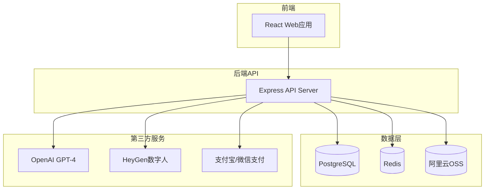

# AI创作助手 - MVP设计文档

## 概述

AI创作助手MVP版本采用前后端分离架构，前端使用React + Ant Design构建，后端使用Node.js + Express提供API服务。系统集成OpenAI GPT-4和HeyGen数字人API，实现AI文案生成和数字人视频制作的核心功能。

**核心设计理念**: 简单、快速、易用

---

## 技术架构

### 系统架构图

### 技术栈

**前端**:
- React 18 + TypeScript
- Ant Design 5.x
- Zustand (状态管理)
- TanStack Query (数据获取)
- React Router v6
- Vite

**后端**:
- Node.js 18+ + Express
- TypeScript
- Prism