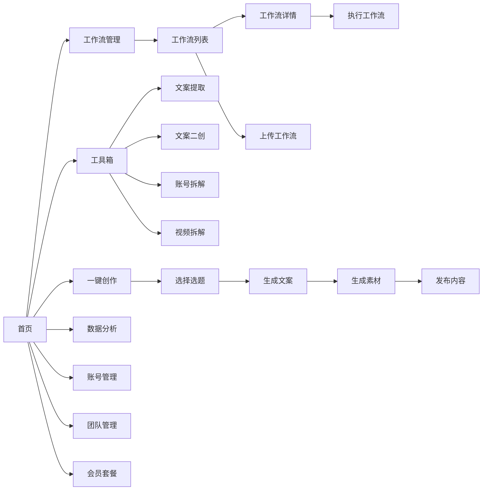

# AI自动运营系统 - UI设计文档

## 1. 首页布局

```mermaid
graph TB
    subgraph "首页 - Home Page"
        Header[顶部导航栏]
        Banner[轮播横幅 - 新功能/热门模板]
        QuickActions[快速操作区]
        ToolsSection[常用工具箱]
        WorkflowSection[热门工作流]
        StatsSection[使用统计]
    end
    
    subgraph "顶部导航栏"
        Logo[Logo]
        NavMenu[导航菜单: 工作流 | 工具箱 | 数据分析 | 账号管理]
        UserInfo[用户信息: 积分 | 会员 | 头像]
    end
    
    subgraph "快速操作区"
        Action1[🚀 一键创作]
        Action2[📝 AI选题]
        Action3[🔄 我的工作流]
    end
    
    subgraph "常用工具箱"
        ToolTabs[标签: 全部 | 文案工具 | 视频工具 | 图片工具]
        ToolGrid[工具卡片网格]
    end
```

### 首页详细布局

```
┌─────────────────────────────────────────────────────────────┐
│  Logo    工作流  工具箱  数据分析  账号管理    💰1000积分 👤  │
├─────────────────────────────────────────────────────────────┤
│                                                               │
│  [轮播横幅 - 新功能介绍 / 热门模板推荐]                      │
│                                                               │
├─────────────────────────────────────────────────────────────┤
│                                                               │
│  快速开始                                                     │
│  ┌──────────┐  ┌──────────┐  ┌──────────┐                  │
│  │ 🚀       │  │ 📝       │  │ 🔄       │                  │
│  │一键创作  │  │ AI选题   │  │我的工作流│                  │
│  └──────────┘  └──────────┘  └──────────┘                  │
│                                                               │
├─────────────────────────────────────────────────────────────┤
│                                                               │
│  常用工具箱    [全部] [文案工具] [视频工具] [图片工具]      │
│                                                               │
│  ┌─────────┐ ┌─────────┐ ┌─────────┐ ┌─────────┐          │
│  │文案提取 │ │文案二创 │ │账号拆解 │ │视频拆解 │          │
│  │         │ │         │ │         │ │         │          │
│  │使用29次 │ │使用45次 │ │使用18次 │ │使用32次 │          │
│  │[立即使用]│ │[立即使用]│ │[立即使用]│ │[立即使用]│          │
│  └─────────┘ └─────────┘ └─────────┘ └─────────┘          │
│                                                               │
├─────────────────────────────────────────────────────────────┤
│                                                               │
│  热门工作流    [查看全部 →]                                  │
│                                                               │
│  ┌─────────┐ ┌─────────┐ ┌─────────┐                       │
│  │爆款文案 │ │视频脚本 │ │数据分析 │                       │
│  │生成器   │ │生成器   │ │助手     │                       │
│  │⭐4.8    │ │⭐4.9    │ │⭐4.7    │                       │
│  │使用1.2k │ │使用980  │ │使用756  │                       │
│  └─────────┘ └─────────┘ └─────────┘                       │
│                                                               │
└─────────────────────────────────────────────────────────────┘
```


## 2. 工作流管理页面

```
┌─────────────────────────────────────────────────────────────┐
│  工作流管理                                    [+ 上传工作流] │
├─────────────────────────────────────────────────────────────┤
│                                                               │
│  筛选: [全部类型▼] [全部分类▼]  🔍 搜索工作流...            │
│                                                               │
│  标签: #内容创作 #数据分析 #营销推广 #数据处理               │
│                                                               │
├─────────────────────────────────────────────────────────────┤
│                                                               │
│  ┌───────────────────────────────────────────────────────┐  │
│  │ 📹 爆款短视频文案生成器                    [Coze]     │  │
│  │                                                         │  │
│  │ 基于热点话题和用户画像，自动生成吸引眼球的短视频文案│  │
│  │                                                         │  │
│  │ 分类: 内容创作  标签: #文案 #短视频 #AI生成           │  │
│  │                                                         │  │
│  │ 💰 5积分/次  📊 使用1,234次  ⭐ 4.8 (156评价)        │  │
│  │                                                         │  │
│  │ [查看详情] [立即使用] [编辑]                           │  │
│  └───────────────────────────────────────────────────────┘  │
│                                                               │
│  ┌───────────────────────────────────────────────────────┐  │
│  │ 📊 账号数据分析助手                        [n8n]      │  │
│  │                                                         │  │
│  │ 自动抓取和分析竞品账号数据，生成详细的分析报告      │  │
│  │                                                         │  │
│  │ 分类: 数据分析  标签: #数据 #分析 #报告               │  │
│  │                                                         │  │
│  │ 💰 10积分/次  📊 使用856次  ⭐ 4.9 (89评价)          │  │
│  │                                                         │  │
│  │ [查看详情] [立即使用] [编辑]                           │  │
│  └───────────────────────────────────────────────────────┘  │
│                                                               │
└─────────────────────────────────────────────────────────────┘
```

### 工作流详情页面

```
┌─────────────────────────────────────────────────────────────┐
│  ← 返回列表                                                   │
├─────────────────────────────────────────────────────────────┤
│                                                               │
│  📹 爆款短视频文案生成器                         [Coze]      │
│                                                               │
│  ⭐⭐⭐⭐⭐ 4.8 (156条评价)  📊 使用1,234次                  │
│                                                               │
│  分类: 内容创作                                               │
│  标签: #文案 #短视频 #AI生成 #爆款                           │
│                                                               │
├─────────────────────────────────────────────────────────────┤
│                                                               │
│  [演示视频]                                                   │
│  ┌─────────────────────────────────────────────────────┐    │
│  │                                                       │    │
│  │          ▶️  播放演示视频                            │    │
│  │                                                       │    │
│  └─────────────────────────────────────────────────────┘    │
│                                                               │
├─────────────────────────────────────────────────────────────┤
│                                                               │
│  [运行界面截图]                                               │
│  ┌──────┐ ┌──────┐ ┌──────┐                                │
│  │截图1 │ │截图2 │ │截图3 │                                │
│  └──────┘ └──────┘ └──────┘                                │
│                                                               │
├─────────────────────────────────────────────────────────────┤
│                                                               │
│  功能说明                                                     │
│  • 支持多种内容类型：搞笑、知识、情感、剧情等                │
│  • 自动分析热点话题，生成贴合趋势的文案                      │
│  • 提供多个文案版本供选择                                     │
│  • 支持自定义风格和语气                                       │
│                                                               │
│  使用步骤                                                     │
│  1. 输入内容主题或关键词                                      │
│  2. 选择目标平台（抖音/小红书/视频号）                       │
│  3. 选择内容风格                                              │
│  4. 点击生成，等待3-5秒                                       │
│  5. 查看生成的文案，选择满意的版本                           │
│                                                               │
│  注意事项                                                     │
│  ⚠️ 每次调用消耗5积分                                        │
│  ⚠️ 生成的文案仅供参考，请根据实际情况修改                   │
│                                                               │
├─────────────────────────────────────────────────────────────┤
│                                                               │
│  [立即使用 - 5积分]  [收藏]  [分享]                          │
│                                                               │
└─────────────────────────────────────────────────────────────┘
```


## 3. 工作流上传页面

```
┌─────────────────────────────────────────────────────────────┐
│  上传工作流                                      [保存] [取消]│
├─────────────────────────────────────────────────────────────┤
│                                                               │
│  基本信息                                                     │
│  ┌─────────────────────────────────────────────────────┐    │
│  │ 工作流名称 *                                          │    │
│  │ [_____________________________]                       │    │
│  │                                                       │    │
│  │ 工作流描述 *                                          │    │
│  │ [_____________________________]                       │    │
│  │ [_____________________________]                       │    │
│  │                                                       │    │
│  │ 工作流类型 *                                          │    │
│  │ ( ) Coze  ( ) n8n                                    │    │
│  │                                                       │    │
│  │ 分类 *                                                │    │
│  │ [选择分类 ▼]                                          │    │
│  │ • 内容创作  • 数据分析  • 营销推广  • 数据处理       │    │
│  │                                                       │    │
│  │ 标签 *                                                │    │
│  │ [添加标签...] #文案 #短视频 #AI生成                  │    │
│  └─────────────────────────────────────────────────────┘    │
│                                                               │
│  技术配置                                                     │
│  ┌─────────────────────────────────────────────────────┐    │
│  │ Webhook URL *                                         │    │
│  │ [https://________________________________]  [测试连接]│    │
│  │                                                       │    │
│  │ API Key (可选)                                        │    │
│  │ [_____________________________]                       │    │
│  │                                                       │    │
│  │ 积分消耗 *                                            │    │
│  │ [___] 积分/次                                         │    │
│  └─────────────────────────────────────────────────────┘    │
│                                                               │
│  演示材料                                                     │
│  ┌─────────────────────────────────────────────────────┐    │
│  │ 演示视频 (可选)                                       │    │
│  │ [📤 上传视频] 支持MP4格式，最大100MB                 │    │
│  │                                                       │    │
│  │ 运行界面截图 *                                        │    │
│  │ [📤 上传截图] 至少上传3张截图                        │    │
│  │ ┌────┐ ┌────┐ ┌────┐                               │    │
│  │ │图1 │ │图2 │ │图3 │                               │    │
│  │ └────┘ └────┘ └────┘                               │    │
│  └─────────────────────────────────────────────────────┘    │
│                                                               │
│  使用说明                                                     │
│  ┌─────────────────────────────────────────────────────┐    │
│  │ 富文本编辑器                                          │    │
│  │ [B] [I] [U] [列表] [链接] [图片]                     │    │
│  │                                                       │    │
│  │ 功能说明：                                            │    │
│  │ • 描述工作流的主要功能                                │    │
│  │                                                       │    │
│  │ 使用步骤：                                            │    │
│  │ 1. 第一步...                                          │    │
│  │ 2. 第二步...                                          │    │
│  │                                                       │    │
│  │ 注意事项：                                            │    │
│  │ • 重要提示...                                         │    │
│  └─────────────────────────────────────────────────────┘    │
│                                                               │
│                                    [保存草稿] [发布工作流]   │
│                                                               │
└─────────────────────────────────────────────────────────────┘
```


## 4. 工作流执行页面

```
┌─────────────────────────────────────────────────────────────┐
│  执行工作流: 爆款短视频文案生成器                             │
├─────────────────────────────────────────────────────────────┤
│                                                               │
│  输入参数                                                     │
│  ┌─────────────────────────────────────────────────────┐    │
│  │ 内容主题 *                                            │    │
│  │ [_____________________________]                       │    │
│  │                                                       │    │
│  │ 目标平台 *                                            │    │
│  │ [ ] 抖音  [ ] 小红书  [ ] 视频号                     │    │
│  │                                                       │    │
│  │ 内容风格                                              │    │
│  │ [选择风格 ▼] 搞笑 / 知识 / 情感 / 剧情              │    │
│  │                                                       │    │
│  │ 其他参数 (JSON格式)                                   │    │
│  │ {                                                     │    │
│  │   "length": "short",                                  │    │
│  │   "tone": "casual"                                    │    │
│  │ }                                                     │    │
│  └─────────────────────────────────────────────────────┘    │
│                                                               │
│  💰 本次执行将消耗 5 积分  (当前余额: 1000积分)             │
│                                                               │
│  [执行工作流]                                                 │
│                                                               │
├─────────────────────────────────────────────────────────────┤
│                                                               │
│  执行状态: ⏳ 执行中... (已用时 3秒)                         │
│                                                               │
│  ┌─────────────────────────────────────────────────────┐    │
│  │ 📤 发送请求到 Webhook...                    ✅ 完成  │    │
│  │ ⏳ 等待响应...                              进行中    │    │
│  │ ⏸️  处理返回数据...                         等待中    │    │
│  └─────────────────────────────────────────────────────┘    │
│                                                               │
└─────────────────────────────────────────────────────────────┘

执行完成后:

┌─────────────────────────────────────────────────────────────┐
│  执行结果                                                     │
├─────────────────────────────────────────────────────────────┤
│                                                               │
│  ✅ 执行成功  用时: 4.2秒  消耗积分: 5                       │
│                                                               │
│  输出结果                                                     │
│  ┌─────────────────────────────────────────────────────┐    │
│  │ 版本1:                                                │    │
│  │ "你知道吗？这个方法让我的粉丝暴涨10倍！今天教你..."  │    │
│  │                                                       │    │
│  │ 版本2:                                                │    │
│  │ "震惊！原来大V都在用这个技巧，难怪涨粉这么快..."    │    │
│  │                                                       │    │
│  │ 版本3:                                                │    │
│  │ "3分钟学会这个方法，让你的视频播放量翻倍！"         │    │
│  └─────────────────────────────────────────────────────┘    │
│                                                               │
│  [复制结果] [保存到内容库] [再次执行]                        │
│                                                               │
│  执行历史                                                     │
│  ┌─────────────────────────────────────────────────────┐    │
│  │ 2024-12-03 14:30  ✅ 成功  5积分  用时4.2秒         │    │
│  │ 2024-12-03 10:15  ✅ 成功  5积分  用时3.8秒         │    │
│  │ 2024-12-02 16:45  ❌ 失败  0积分  错误: 超时        │    │
│  └─────────────────────────────────────────────────────┘    │
│                                                               │
└─────────────────────────────────────────────────────────────┘
```


## 5. 内容创作页面

```
┌─────────────────────────────────────────────────────────────┐
│  一键创作                                                     │
├─────────────────────────────────────────────────────────────┤
│                                                               │
│  步骤 1/4: 选择选题                                           │
│  ━━━━━━━━━━━━━━━━━━━━━━━━━━━━━━━━━━━━━━━━━━━━━━━━━━━━━━━  │
│                                                               │
│  🔍 搜索选题: [_____________________________] [搜索]        │
│                                                               │
│  热门选题                                                     │
│  ┌─────────────────────────────────────────────────────┐    │
│  │ ( ) 如何在30天内涨粉10万                              │    │
│  │     🔥 热度: 9.8  💬 适合: 知识分享                  │    │
│  │                                                       │    │
│  │ ( ) 2024年最火的短视频拍摄技巧                        │    │
│  │     🔥 热度: 9.5  💬 适合: 教程类                    │    │
│  │                                                       │    │
│  │ ( ) 普通人如何通过短视频月入过万                      │    │
│  │     🔥 热度: 9.2  💬 适合: 励志类                    │    │
│  └─────────────────────────────────────────────────────┘    │
│                                                               │
│  或者自定义选题: [_____________________________]             │
│                                                               │
│                                              [下一步 →]       │
│                                                               │
└─────────────────────────────────────────────────────────────┘

步骤 2/4: 生成文案

┌─────────────────────────────────────────────────────────────┐
│  步骤 2/4: 生成文案                                           │
│  ━━━━━━━━━━━━━━━━━━━━━━━━━━━━━━━━━━━━━━━━━━━━━━━━━━━━━━━  │
│                                                               │
│  选题: 如何在30天内涨粉10万                                   │
│                                                               │
│  目标平台: [ ] 抖音  [ ] 小红书  [ ] 视频号                 │
│  内容风格: [知识分享 ▼]                                       │
│                                                               │
│  ⏳ 正在生成文案... (预计需要5-10秒)                         │
│                                                               │
│  ┌─────────────────────────────────────────────────────┐    │
│  │ 生成的文案:                                           │    │
│  │                                                       │    │
│  │ 标题: 30天涨粉10万的秘密，我终于找到了！             │    │
│  │                                                       │    │
│  │ 正文:                                                 │    │
│  │ 大家好，我是XXX。今天要分享一个让我在30天内涨粉    │    │
│  │ 10万的方法。这个方法分为三个步骤...                 │    │
│  │                                                       │    │
│  │ 标签: #涨粉技巧 #短视频运营 #新手必看               │    │
│  │                                                       │    │
│  │ [重新生成] [编辑文案]                                 │    │
│  └─────────────────────────────────────────────────────┘    │
│                                                               │
│                                    [← 上一步] [下一步 →]     │
│                                                               │
└─────────────────────────────────────────────────────────────┘

步骤 3/4: 生成素材

┌─────────────────────────────────────────────────────────────┐
│  步骤 3/4: 生成素材                                           │
│  ━━━━━━━━━━━━━━━━━━━━━━━━━━━━━━━━━━━━━━━━━━━━━━━━━━━━━━━  │
│                                                               │
│  ⏳ 正在生成视频素材... (预计需要30-60秒)                    │
│                                                               │
│  ┌─────────────────────────────────────────────────────┐    │
│  │ 视频预览                                              │    │
│  │ ┌───────────────────────────────────────────────┐   │    │
│  │ │                                                 │   │    │
│  │ │          ▶️  播放预览                          │   │    │
│  │ │                                                 │   │    │
│  │ │          时长: 1:23                             │   │    │
│  │ └───────────────────────────────────────────────┘   │    │
│  │                                                       │    │
│  │ 配音: [AI配音 ▼] 男声 / 女声 / 童声                 │    │
│  │ 背景音乐: [选择音乐 ▼]                               │    │
│  │                                                       │    │
│  │ [重新生成] [上传自己的素材]                          │    │
│  └─────────────────────────────────────────────────────┘    │
│                                                               │
│                                    [← 上一步] [下一步 →]     │
│                                                               │
└─────────────────────────────────────────────────────────────┘

步骤 4/4: 发布内容

┌─────────────────────────────────────────────────────────────┐
│  步骤 4/4: 发布内容                                           │
│  ━━━━━━━━━━━━━━━━━━━━━━━━━━━━━━━━━━━━━━━━━━━━━━━━━━━━━━━  │
│                                                               │
│  选择发布平台:                                                │
│  [✓] 抖音 - @我的抖音号                                      │
│  [✓] 小红书 - @我的小红书号                                  │
│  [ ] 视频号 - 未绑定 [立即绑定]                              │
│                                                               │
│  发布时间:                                                    │
│  ( ) 立即发布                                                 │
│  ( ) 定时发布  [2024-12-03] [18:00]                         │
│                                                               │
│  内容预览:                                                    │
│  ┌─────────────────────────────────────────────────────┐    │
│  │ 标题: 30天涨粉10万的秘密，我终于找到了！             │    │
│  │ 封面: [图片预览]                                      │    │
│  │ 标签: #涨粉技巧 #短视频运营 #新手必看               │    │
│  └─────────────────────────────────────────────────────┘    │
│                                                               │
│                          [← 上一步] [确认发布]               │
│                                                               │
└─────────────────────────────────────────────────────────────┘
```


## 6. 数据分析页面

```
┌─────────────────────────────────────────────────────────────┐
│  数据分析                                                     │
├─────────────────────────────────────────────────────────────┤
│                                                               │
│  时间范围: [最近7天 ▼]  平台: [全部平台 ▼]                  │
│                                                               │
│  ┌──────────────┐ ┌──────────────┐ ┌──────────────┐        │
│  │ 总播放量     │ │ 总点赞数     │ │ 总评论数     │        │
│  │              │ │              │ │              │        │
│  │   125.6K     │ │    8.9K      │ │    2.3K      │        │
│  │   ↑ 23%     │ │   ↑ 15%     │ │   ↑ 8%      │        │
│  └──────────────┘ └──────────────┘ └──────────────┘        │
│                                                               │
│  ┌──────────────┐ ┌──────────────┐ ┌──────────────┐        │
│  │ 总分享数     │ │ 新增粉丝     │ │ 内容发布数   │        │
│  │              │ │              │ │              │        │
│  │    1.2K      │ │     856      │ │      12      │        │
│  │   ↑ 12%     │ │   ↑ 45%     │ │   → 0%      │        │
│  └──────────────┘ └──────────────┘ └──────────────┘        │
│                                                               │
├─────────────────────────────────────────────────────────────┤
│                                                               │
│  数据趋势                                                     │
│  ┌─────────────────────────────────────────────────────┐    │
│  │                                                       │    │
│  │  播放量                                               │    │
│  │  20K ┤                                          ╱    │    │
│  │      │                                     ╱────     │    │
│  │  15K ┤                              ╱─────           │    │
│  │      │                         ╱────                 │    │
│  │  10K ┤                    ╱────                      │    │
│  │      │               ╱────                           │    │
│  │   5K ┤          ╱────                                │    │
│  │      │     ╱────                                     │    │
│  │   0K └─────┴─────┴─────┴─────┴─────┴─────┴─────    │    │
│  │      12/1  12/2  12/3  12/4  12/5  12/6  12/7       │    │
│  │                                                       │    │
│  │  ─── 播放量  ─── 点赞数  ─── 评论数                 │    │
│  └─────────────────────────────────────────────────────┘    │
│                                                               │
├─────────────────────────────────────────────────────────────┤
│                                                               │
│  内容表现排行                                                 │
│  ┌─────────────────────────────────────────────────────┐    │
│  │ 排名  内容标题              播放量   点赞   评论     │    │
│  │ ─────────────────────────────────────────────────── │    │
│  │  1   30天涨粉10万的秘密    45.2K   3.2K   856      │    │
│  │  2   短视频拍摄技巧大全    38.9K   2.8K   723      │    │
│  │  3   新手必看的运营指南    32.1K   2.1K   645      │    │
│  │  4   如何提高视频完播率    28.5K   1.9K   512      │    │
│  │  5   爆款文案写作技巧      25.3K   1.7K   489      │    │
│  └─────────────────────────────────────────────────────┘    │
│                                                               │
│  [导出Excel报表] [生成PDF报告]                               │
│                                                               │
└─────────────────────────────────────────────────────────────┘
```


## 7. 账号管理页面

```
┌─────────────────────────────────────────────────────────────┐
│  账号管理                                        [+ 添加账号] │
├─────────────────────────────────────────────────────────────┤
│                                                               │
│  已连接账号                                                   │
│                                                               │
│  ┌───────────────────────────────────────────────────────┐  │
│  │ 📱 抖音                                      ✅ 已连接  │  │
│  │                                                         │  │
│  │ 账号名: @我的抖音号                                     │  │
│  │ 粉丝数: 12.5K                                           │  │
│  │ 连接时间: 2024-11-15                                    │  │
│  │ 授权状态: 正常 (有效期至 2025-11-15)                   │  │
│  │                                                         │  │
│  │ [查看详情] [解除绑定]                                   │  │
│  └───────────────────────────────────────────────────────┘  │
│                                                               │
│  ┌───────────────────────────────────────────────────────┐  │
│  │ 📕 小红书                                    ✅ 已连接  │  │
│  │                                                         │  │
│  │ 账号名: @我的小红书号                                   │  │
│  │ 粉丝数: 8.3K                                            │  │
│  │ 连接时间: 2024-10-20                                    │  │
│  │ 授权状态: 正常 (有效期至 2025-10-20)                   │  │
│  │                                                         │  │
│  │ [查看详情] [解除绑定]                                   │  │
│  └───────────────────────────────────────────────────────┘  │
│                                                               │
│  ┌───────────────────────────────────────────────────────┐  │
│  │ 📹 视频号                                    ⚠️ 未连接  │  │
│  │                                                         │  │
│  │ 还未连接视频号账号                                      │  │
│  │                                                         │  │
│  │ [立即连接]                                              │  │
│  └───────────────────────────────────────────────────────┘  │
│                                                               │
├─────────────────────────────────────────────────────────────┤
│                                                               │
│  发布历史                                                     │
│  ┌─────────────────────────────────────────────────────┐    │
│  │ 时间          平台      内容标题            状态     │    │
│  │ ───────────────────────────────────────────────────  │    │
│  │ 12-03 14:30  抖音      30天涨粉10万...    ✅ 成功   │    │
│  │ 12-03 10:15  小红书    短视频拍摄技巧...  ✅ 成功   │    │
│  │ 12-02 18:00  抖音      新手运营指南...    ✅ 成功   │    │
│  │ 12-02 16:45  小红书    爆款文案技巧...    ❌ 失败   │    │
│  │ 12-01 20:30  抖音      如何提高完播率...  ✅ 成功   │    │
│  └─────────────────────────────────────────────────────┘    │
│                                                               │
└─────────────────────────────────────────────────────────────┘
```

## 8. 会员套餐页面

```
┌─────────────────────────────────────────────────────────────┐
│  会员套餐                                                     │
├─────────────────────────────────────────────────────────────┤
│                                                               │
│  当前套餐: 基础版  到期时间: 2024-12-31                      │
│  剩余积分: 1000                                               │
│                                                               │
├─────────────────────────────────────────────────────────────┤
│                                                               │
│  ┌──────────┐  ┌──────────┐  ┌──────────┐  ┌──────────┐   │
│  │ 免费版   │  │ 基础版   │  │ 专业版   │  │ 企业版   │   │
│  │          │  │  推荐    │  │          │  │          │   │
│  │ ¥0/月   │  │ ¥99/月  │  │ ¥299/月 │  │ ¥999/月 │   │
│  │          │  │          │  │          │  │          │   │
│  │ 100积分  │  │ 1000积分 │  │ 5000积分 │  │ 20000积分│   │
│  │          │  │          │  │          │  │          │   │
│  │ ✓ 基础   │  │ ✓ 全部   │  │ ✓ 全部   │  │ ✓ 全部   │   │
│  │   工具   │  │   工具   │  │   工具   │  │   工具   │   │
│  │          │  │          │  │          │  │          │   │
│  │ ✓ 3个    │  │ ✓ 10个   │  │ ✓ 50个   │  │ ✓ 无限   │   │
│  │   工作流 │  │   工作流 │  │   工作流 │  │   工作流 │   │
│  │          │  │          │  │          │  │          │   │
│  │ ✗ 团队   │  │ ✗ 团队   │  │ ✓ 5人    │  │ ✓ 20人   │   │
│  │   管理   │  │   管理   │  │   团队   │  │   团队   │   │
│  │          │  │          │  │          │  │          │   │
│  │ ✗ 优先   │  │ ✗ 优先   │  │ ✓ 优先   │  │ ✓ 专属   │   │
│  │   支持   │  │   支持   │  │   支持   │  │   客服   │   │
│  │          │  │          │  │          │  │          │   │
│  │ [当前]   │  │ [升级]   │  │ [升级]   │  │ [升级]   │   │
│  └──────────┘  └──────────┘  └──────────┘  └──────────┘   │
│                                                               │
├─────────────────────────────────────────────────────────────┤
│                                                               │
│  功能对比                                                     │
│  ┌─────────────────────────────────────────────────────┐    │
│  │ 功能              免费版  基础版  专业版  企业版     │    │
│  │ ─────────────────────────────────────────────────── │    │
│  │ 每月积分           100    1000    5000   20000      │    │
│  │ 工作流数量          3      10      50     无限      │    │
│  │ 内容发布数量        10     100     500    无限      │    │
│  │ 数据分析           基础    高级    高级    高级      │    │
│  │ 团队成员            -      -       5      20        │    │
│  │ API调用            -      -       ✓      ✓         │    │
│  │ 优先支持           -      -       ✓      ✓         │    │
│  │ 专属客服           -      -       -      ✓         │    │
│  └─────────────────────────────────────────────────────┘    │
│                                                               │
└─────────────────────────────────────────────────────────────┘
```


## 9. 团队管理页面 (MCN功能)

```
┌─────────────────────────────────────────────────────────────┐
│  团队管理                                        [+ 邀请成员] │
├─────────────────────────────────────────────────────────────┤
│                                                               │
│  团队概览                                                     │
│  ┌──────────────┐ ┌──────────────┐ ┌──────────────┐        │
│  │ 团队成员     │ │ 总配额       │ │ 已使用       │        │
│  │              │ │              │ │              │        │
│  │     12       │ │   50,000     │ │   32,450     │        │
│  │              │ │   积分/月    │ │   积分       │        │
│  └──────────────┘ └──────────────┘ └──────────────┘        │
│                                                               │
│  ┌──────────────┐ ┌──────────────┐ ┌──────────────┐        │
│  │ 本月内容     │ │ 本月工作流   │ │ 活跃成员     │        │
│  │              │ │              │ │              │        │
│  │     156      │ │     423      │ │      10      │        │
│  │     条       │ │     次       │ │     人       │        │
│  └──────────────┘ └──────────────┘ └──────────────┘        │
│                                                               │
├─────────────────────────────────────────────────────────────┤
│                                                               │
│  成员列表                                                     │
│  ┌─────────────────────────────────────────────────────┐    │
│  │ 成员        角色    配额      已用    状态    操作   │    │
│  │ ───────────────────────────────────────────────────  │    │
│  │ 张三        管理员  10,000   8,234   正常   [编辑]  │    │
│  │ 李四        成员    5,000    4,123   正常   [编辑]  │    │
│  │ 王五        成员    5,000    3,890   正常   [编辑]  │    │
│  │ 赵六        成员    3,000    2,567   正常   [编辑]  │    │
│  │ 孙七        成员    3,000    2,890   超额   [编辑]  │    │
│  │ 周八        成员    2,000      456   正常   [编辑]  │    │
│  └─────────────────────────────────────────────────────┘    │
│                                                               │
│  [批量导入] [导出数据]                                        │
│                                                               │
└─────────────────────────────────────────────────────────────┘

编辑成员配额弹窗:

┌─────────────────────────────────────────────────────────────┐
│  编辑成员配额                                    [×]          │
├─────────────────────────────────────────────────────────────┤
│                                                               │
│  成员信息                                                     │
│  姓名: 李四                                                   │
│  邮箱: lisi@example.com                                       │
│  加入时间: 2024-10-15                                         │
│                                                               │
│  当前配额: 5,000 积分/月                                      │
│  已使用: 4,123 积分                                           │
│  剩余: 877 积分                                               │
│                                                               │
│  新配额设置                                                   │
│  ┌─────────────────────────────────────────────────────┐    │
│  │ 每月配额 (积分)                                       │    │
│  │ [_____] 积分                                          │    │
│  │                                                       │    │
│  │ 建议配额: 3000 / 5000 / 10000                        │    │
│  └─────────────────────────────────────────────────────┘    │
│                                                               │
│  角色权限                                                     │
│  ( ) 管理员 - 可以管理团队成员和配额                         │
│  (•) 成员 - 只能使用分配的积分                               │
│                                                               │
│                                          [取消] [保存更改]    │
│                                                               │
└─────────────────────────────────────────────────────────────┘
```

## 10. 移动端适配示例

```
┌─────────────────┐
│  ☰  Logo   👤  │  <- 顶部导航栏（汉堡菜单）
├─────────────────┤
│                 │
│  [轮播横幅]     │
│                 │
├─────────────────┤
│                 │
│  快速操作       │
│  ┌───────────┐ │
│  │🚀 一键创作│ │
│  └───────────┘ │
│  ┌───────────┐ │
│  │📝 AI选题  │ │
│  └───────────┘ │
│  ┌───────────┐ │
│  │🔄 工作流  │ │
│  └───────────┘ │
│                 │
├─────────────────┤
│                 │
│  常用工具       │
│  [全部▼]       │
│                 │
│  ┌───────────┐ │
│  │文案提取   │ │
│  │使用29次   │ │
│  │[使用]     │ │
│  └───────────┘ │
│                 │
│  ┌───────────┐ │
│  │文案二创   │ │
│  │使用45次   │ │
│  │[使用]     │ │
│  └───────────┘ │
│                 │
└─────────────────┘
```

## 11. 页面交互流程图



## 12. 设计规范

### 颜色方案
- **主色**: #1890ff (Ant Design 蓝色)
- **成功**: #52c41a (绿色)
- **警告**: #faad14 (橙色)
- **错误**: #f5222d (红色)
- **文字**: #262626 (深灰)
- **次要文字**: #8c8c8c (中灰)
- **边框**: #d9d9d9 (浅灰)
- **背景**: #f0f2f5 (浅灰背景)

### 字体
- **标题**: PingFang SC, Microsoft YaHei, sans-serif
- **正文**: 14px
- **小字**: 12px
- **标题**: 16px-24px

### 间距
- **小间距**: 8px
- **中间距**: 16px
- **大间距**: 24px
- **卡片内边距**: 24px

### 圆角
- **按钮**: 4px
- **卡片**: 8px
- **输入框**: 4px

### 阴影
- **卡片**: 0 2px 8px rgba(0,0,0,0.1)
- **悬浮**: 0 4px 12px rgba(0,0,0,0.15)

